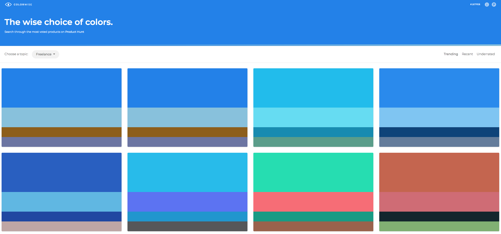

Today I am going to round up some of the great online tools I have found recently that help us web developers choose good colour schemes. It all depends on the kind of image you wish your websites to present, certain schemes work well and if you are not a designer by trade, it can be very hard to know what is "right" or "wrong". Now that is of course always going to be subjective. You may choose fairly muted colours for the bulk of your content and some stronger tones that work better for your "call to action" buttons and other key elements of a good UI.

## 1 - Colorwise.io

Colorwise allows you to scroll "infinitely" through a selection of different colour schemes and selecting any one of them reveals a detail page. The details view includes examples of each of the colour swatches and some Lorem Ipsum text to give you a rough idea. You can also download a set of files in Sketch format for design work. 

It is possible from the main page to filter the main results via topic, so if you are building an analytics site, then you may want some fairly strong primary or secondary colours for your page templates. You can also view the trending colours and some other useful ways to help you make your choices.

## 2 - w3schools Colour Picker

[w3schools color picker](https://www.w3schools.com/colors/colors_picker.asp)

One of my all time favourite sites, which is starting to look a bit dated these days but this tool is as good as any to help you choose colours through a variety of ways and to find out what Hex codes represent them. Not as advanced as Colorwise but still useful if you just need some colours to go with.

## 3 - Coolors.co

[Coolors.co](https://coolors.co/)

If you are in need of inspiration, then this site and tool are probably more apt for your needs. It generates a series of colours that work well as a scheme, providing you with the hex codes and the ability to fine tune each band of colour. I have often used this as a means of choosing my colour pallette. Generally a few colours are all I need for the sites I produce.