## Unique user hits and session figures

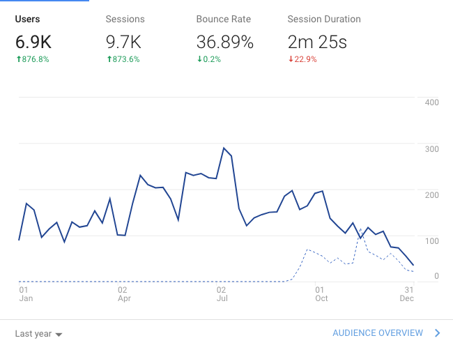

Last year saw a massive increase in traffic over 2016 of over 800%, though this may be in part due to the fact that only the last quarter of 2016 was accurately tracked. So this year we will be able to refer back to this document and compare the two. It is interesting to see that the Summer months saw the most traffic with interest sloping off just before Christmas which is probably not all that unusual.

A similar pattern can be seen in the sessions graph the fact the figure of 9.7k is higher would make sense because this would account for each of the 6k users making return visits to the website. So I would typically expect this figure to be higher rather than the reverse.

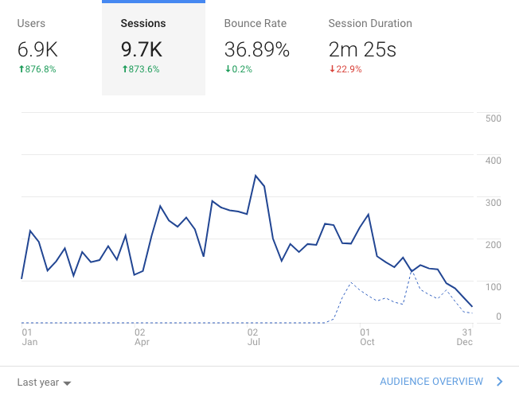

The drop of 22% on the session duration is a good sign because this probably suggests that our visitors are now finding the information they need faster than they used to. The content has been shuffled around a lot since we started and has more than likely improved the experience that people have of the website.

## Active Users
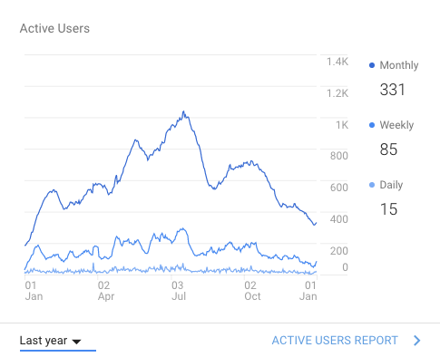

## Page views
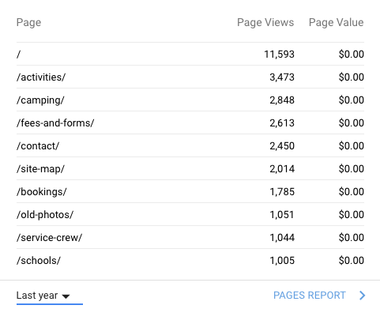

These figures are looking healthy and I would value your input on this because there are ways that we could boost certain parts of the site if you feel that we should. Let's say you want Schools to receive an increase of 200%, we could look at how that could be achieved.

## Referrals
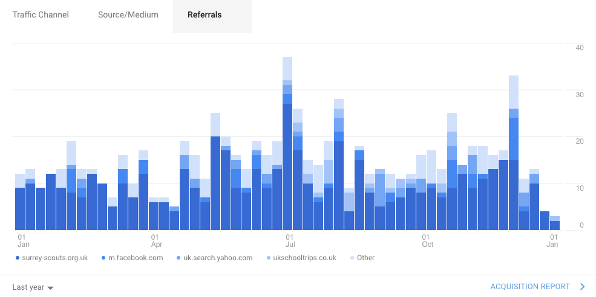

## Traffic channels
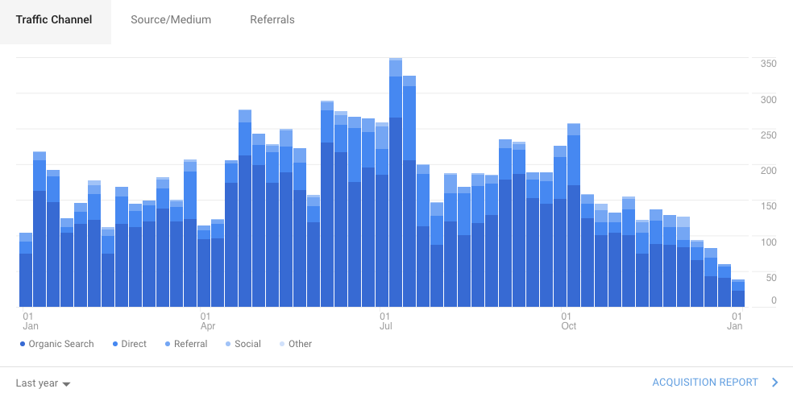
## Traffic by medium
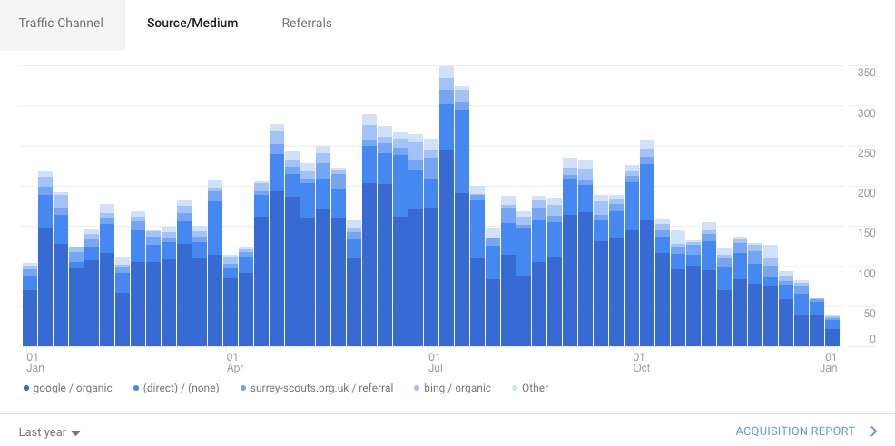

## Sessions by Country
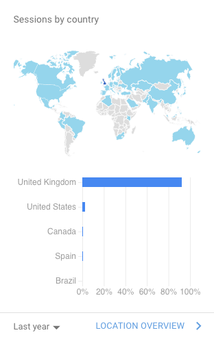

It is great to see that your site is on the global stage but even better when we can see it is reaching the right people, in the correct places. I have drilled deeper and can tell you that across the UK the figures look like this:

* England = 8,834 sessions across the year with 6k of them being new users
* You also had a smaller number of hits from other UK countries 

We can now drill down further and see which parts of England we had the most reach:

* London tops the charts with over 2000 sessions and most of them were new to the site, interesting
* Guildford 705 with around half of those people being "new" the rest were regular visitors
* I could go on listing out hundreds of other towns but in general we have the attention of towns such as Farnborough, Woking, Croydon, Epsom, Godalming, Dorking and Camberley that occupy the Top ten chart!

To sum up here is an interesting map showing where the hits occur across the country...

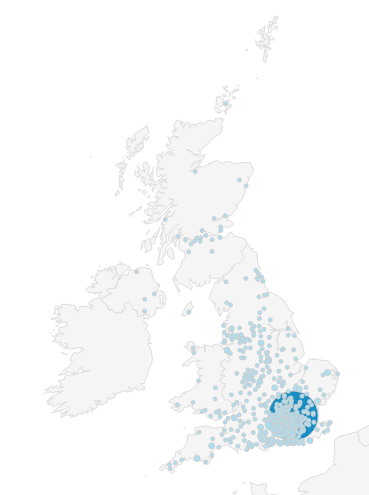
## Sessions by device
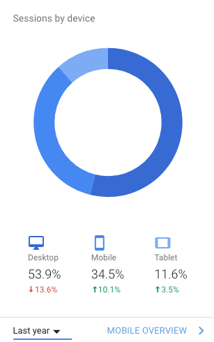

The growing trend across the web nowadays on so many sites is that the mighty mobile is taking over and usage on desktop screens is in decline, this graph shows this very clearly indeed. What does this mean for us, to ensure that our mobile experience is on par with other websites and it is! Though I would suggest we review the way information comes up on the mobile screen, it coul be that you may wish to evaluate this? We can help with this of course and make suggestions. 

## Users by time of day
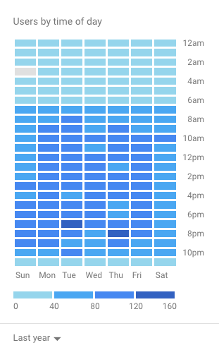

